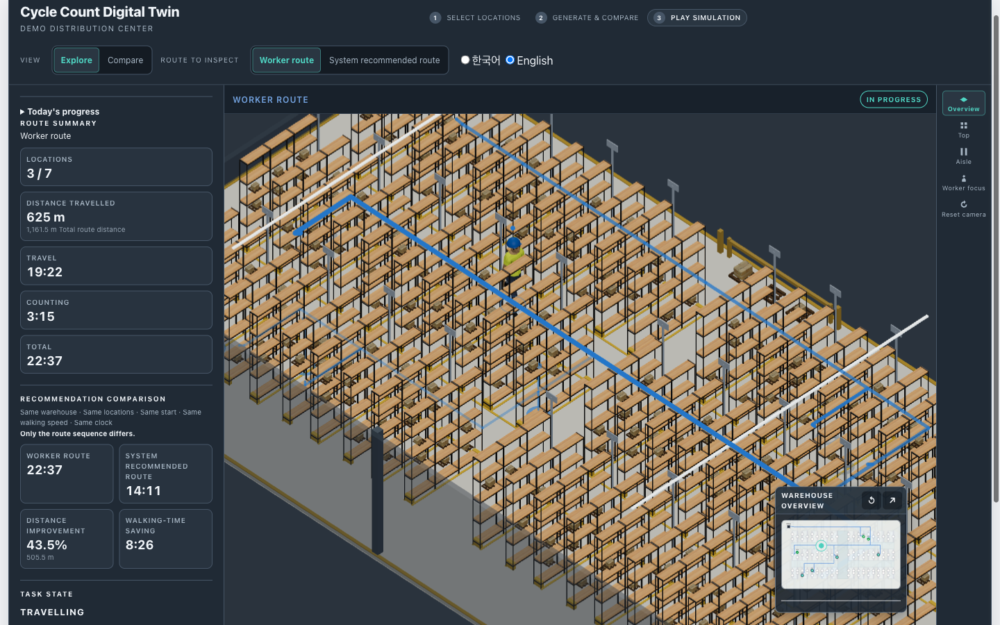
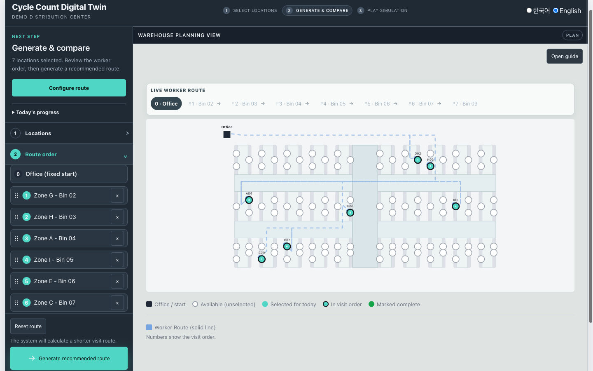
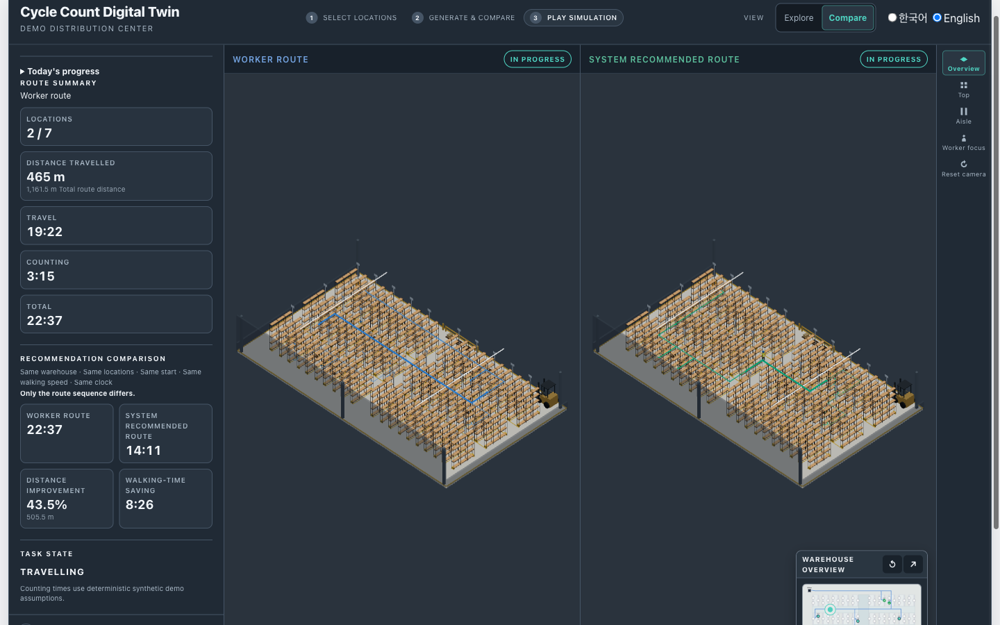
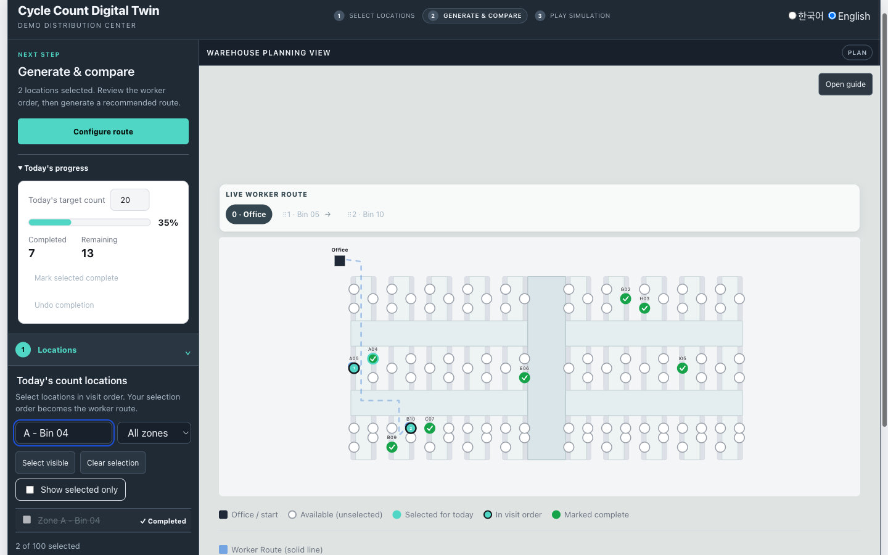

# Cycle Count Route Optimizer

**A warehouse route-planning and Digital Twin simulation tool for reducing non-value-added walking during cycle counting.**

[Live demo](https://cycle-count-route-optimizer.vercel.app) ·
[Demo video](docs/assets/demo/cycle-count-route-optimizer-demo.mp4) ·
[Case study](docs/PORTFOLIO_CASE_STUDY.md) ·
[Architecture](docs/ARCHITECTURE.md)



### Illustrative scenario

Seven bins across two rack blocks, entered in the order a count list sorted by **bin ID** rather than by location would arrive:

| | Worker route | Recommended route |
|---|---|---|
| Travel distance | 1,161.5 m | 656.0 m |
| Operating time | 22:37 | 14:11 |

**505.5 m and 8:26 of walking saved — a 43.5% reduction in travel distance.**

These are real outputs of the deployed application for **one reproducible illustrative scenario using a fixed bin-ID ordering rule** — not a warehouse-wide benchmark, a population average, or a typical or expected result. The same seven bins entered in zone order produce 0.0%, because that order is already optimal.

---

## The operational problem

Cycle counting is a recurring inventory-control process: rather than shutting a facility down for a full physical inventory, a rotating subset of storage locations is counted and reconciled against system inventory. A worker is handed a list of bins and has to walk them.

Execution time splits into two parts that behave differently:

- **Travel** — walking between locations. Necessary non-value-added time: it enables the count but does not itself improve inventory accuracy.
- **Service (counting)** — the work at the bin. The value-adding part, and its duration depends on the location, not the route.

Sequencing affects only the first, so a tool reporting a single blended "time saved" number overstates its own value.

One more constraint separates warehouse routing from generic point-to-point optimization: **workers cannot walk through racking.** Two bins can be metres apart in a straight line and far apart on foot, because reaching one from the other means walking to the end of an aisle and back down the next.

## How it works



1. **Select** the locations that need counting today, filtered by zone or search.
2. **Selection order becomes the visit order** — the plan is a by-product of choosing the work, not a separate step.
3. **Drag to refine** the sequence, or use keyboard-accessible move controls.
4. **Generate the recommended route** over the exact same target set.
5. **Compare** travel distance and walking time.
6. **Replay both plans** in the 3D Digital Twin under one shared clock.
7. **Watch travel and counting** as distinct physical states.
8. **Complete the work** — completed locations leave the active target pool.

## Worker vs. Recommended



The **worker route** is the operator's own visit sequence. The **recommended route** is a Nearest Neighbor heuristic refined by 2-opt local search.

Both run over the same warehouse, the same locations, the same start point, the same walking speed, and the same per-location service assumptions, under one playback clock. **Only the route sequence differs** — which is what makes the comparison a controlled one rather than a demo.

## Route optimization

The warehouse is modeled as a graph with two distinct kinds of point, and keeping them distinct is the core modeling decision:

- **Aisle nodes** are walkable positions in the aisle network, joined by edges with real lengths.
- **Attachment points** — every cycle-count location, plus the start point — are *not* walkable. Each hangs off exactly one aisle node by a short access spur.

This prevents the worst bug class in warehouse routing: a bin silently used as a pass-through waypoint in someone else's path. A worker walks *past* a rack face, never *through* a bin. All routing distance comes from aisle edge lengths and access spurs — never from screen or 3D-world geometry.

On that graph: **Dijkstra** computes aisle-constrained shortest paths into an all-pairs distance matrix over the visit set — the start point plus the locations being routed; **Nearest Neighbor** builds an initial sequence with deterministic tie-breaking; **2-opt** improves it by reversing segments while that strictly reduces the real open-path total.

**The recommended route is heuristic, not a guaranteed global optimum.** It reaches a 2-opt local optimum — no improving segment reversal remains, which says nothing about moves outside that neighbourhood. This is not an exact TSP solver, and there is no machine learning anywhere in the project. Where the worker's own route is already good, the app reports 0.0% rather than manufacturing a win.

## Physical simulation

Route truth flows through three layers, each with one job:

- **`RouteTraversal`** — spatial truth: the node-by-node walk, expanded without recomputing anything.
- **`RouteTimeline`** — temporal truth: one physical time axis of `TRAVEL` phases and `SERVICE` phases.
- **`SimulationSnapshot`** — renderer-independent state at one instant.

Service durations are assigned per location from a stable ordinal of the location id, so a bin always carries the same workload regardless of route order or which route is simulated. **Service time never enters optimization** — it is absent from Dijkstra, Nearest Neighbor, 2-opt, route scoring, and the walking KPI.

Playback rate (0.5×–10×) changes replay progression only. It cannot alter route distance, walking duration, service duration, or any KPI — those are computed before the clock exists. Physical walking speed is a separate quantity entirely.

The 3D layer exists because the audience is operational: a route printed as a list of bin ids does not let anyone judge whether a plan is sensible, but watching an operator cross a building between two consecutive stops does. It uses CC0 rack, pallet, carton, and rigged-operator assets dressed renderer-side in warehouse PPE with a handheld scanner. The walk cycle is driven by distance travelled rather than by a clock, so pausing freezes the stride and seeking lands on the pose belonging to that point of the route.

## Architecture


**Operational truth flows into presentation; the renderer can never redefine it.**

- Domain and simulation code never import the renderer or asset layer — enforced by a test that globs every source file in both directories.
- Display and 3D-world coordinates reach renderers only. A test applies an *anisotropic* transform to every display coordinate and asserts both routes stay byte-identical.
- Service profiles enter `RouteTimeline`, never the optimizer.
- Worker and Recommended share every assumption and one clock while keeping independent route truth.

Detailed diagrams: [docs/ARCHITECTURE.md](docs/ARCHITECTURE.md)

## Completion workflow



Completion is operational state, not a cosmetic checkbox. Completed locations leave the selection and the route, and are locked out of reselection. Undo restores eligibility without silently reinserting the target into the current plan.

## Demo video

**[Watch the 31-second production demo →](docs/assets/demo/cycle-count-route-optimizer-demo.mp4)** *(MP4, 3.5 MB, silent)*

Plan → optimize → simulate → count → complete, recorded from the deployed application in one continuous session.

## Verification

```
657 tests passed / 0 failed        TypeScript  PASS
47 test files                      lint        PASS
                                   build       PASS
```

Frame pacing measured against the deployed build in real Chrome, sampling `requestAnimationFrame` for 9 seconds per scenario with a long-task observer running:

| Scenario | Median | p95 | Frames > 33 ms | Long tasks |
|---|---|---|---|---|
| Explore | 16.7 ms | 16.8 ms | 0 | 0 |
| Worker Focus | 16.7 ms | 16.7 ms | 0 | 0 |
| Compare (dual canvas) | 16.7 ms | 16.8 ms | 0 | 0 |

Asset reuse was verified across 14 consecutive Explore↔Compare cycles with zero duplicate network requests. **These measurements come from one tested desktop Chrome environment and are not a claim about all hardware.**

## Key engineering decisions

- Modeled travel as aisle-constrained graph movement rather than Euclidean screen distance, with bins as non-walkable attachment points so they can never become pass-through waypoints.
- Kept service time outside route optimization, because sequencing compresses travel and nothing else.
- Chose heuristic optimization and said so, rather than implying exact TSP optimality.
- Separated playback rate from physical truth, so reported numbers cannot shift when someone hits fast-forward.
- Made rendering read-only with respect to domain state, and encoded that as executable tests rather than documentation.
- Kept Compare as two independent canvases for route, camera, and skeleton isolation after measuring it costs nothing in frame pacing.
- Measured production performance before optimizing, then declined to optimize on the evidence.

## What this project demonstrates

**Logistics** — cycle-count workflow modeling, aisle-constrained spatial reasoning, the travel/service distinction, completion-state logic.

**Algorithms** — graph modeling, shortest paths, heuristic route optimization over a fixed-start open path, deterministic comparison.

**Software and 3D** — React and TypeScript architecture, a layered simulation model, persistence with regression tests, Three.js / React Three Fiber, a licence-audited asset pipeline with procedural fallbacks.

**Product** — designing the workflow around how the work is actually done, progressive disclosure, and shipping it.

## Tech stack

React 19 · TypeScript · Vite · Three.js 0.185 · React Three Fiber 9 · Vitest · oxlint · deployed on Vercel. No backend, no database, no environment variables.

## Run locally

```bash
npm install
npm run dev      # Vite dev server
npm test         # vitest run
npm run build    # tsc -b && vite build
```

## Production

Deployed at **https://cycle-count-route-optimizer.vercel.app**

A portfolio demonstration. It runs entirely in the browser against one deterministic, synthetic 100-location warehouse fixture included in the repository. The counting service durations (20 / 35 / 60 seconds by class) are synthetic demo assumptions, disclosed as such in the UI — not measured productivity standards. The project has not been deployed against a real facility, and no figure it displays is a measured result from any real warehouse or customer.

---

**[Read the full case study → docs/PORTFOLIO_CASE_STUDY.md](docs/PORTFOLIO_CASE_STUDY.md)**

Built by [sahorabin](https://github.com/sahorabin).
