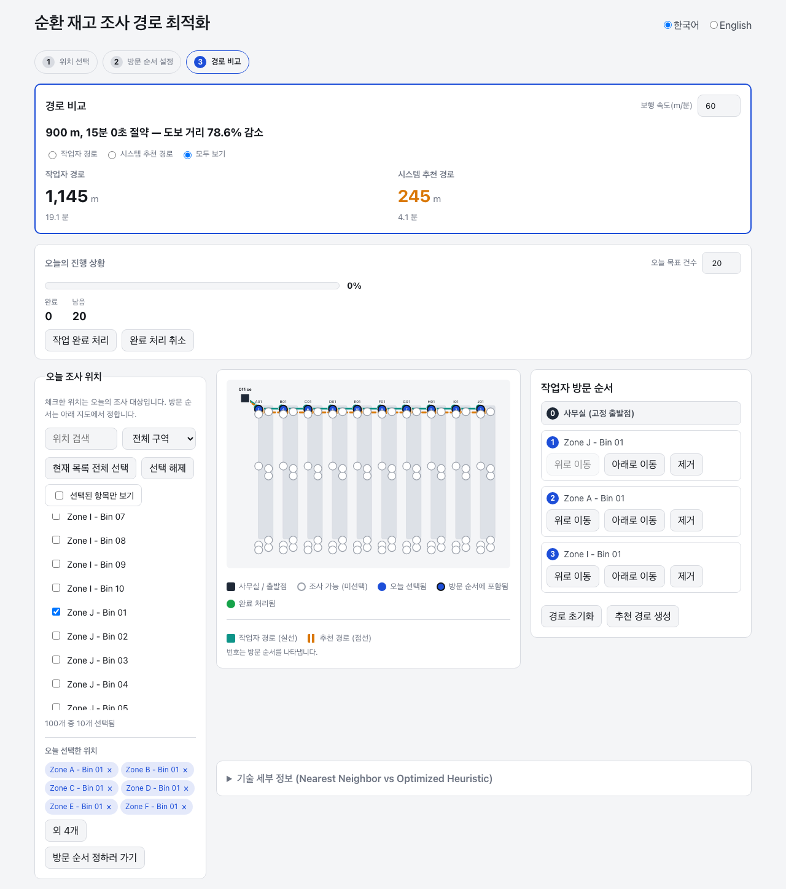
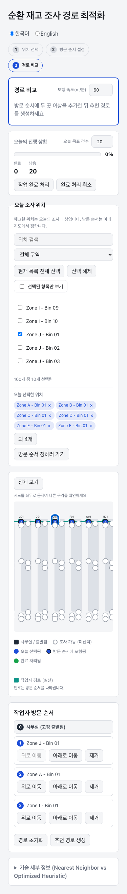

# Cycle Count Route Optimizer

A browser-based tool that helps a warehouse worker plan a physical walking
route for a cycle count (a partial, recurring inventory audit) and compares
it against a system-generated route over the same stops.

## Problem statement

Warehouse workers doing cycle counts typically pick which bins to check and
then walk them in whatever order occurs to them. That order is rarely the
shortest path through the aisles, and there's usually no easy way to see how
much walking a better-ordered route would save before committing to one.

## What the application does

The app models a warehouse as a graph of aisles and cycle-count locations,
lets a worker pick today's count locations and build a visit order by
clicking them on a floor-plan map, then computes a system-recommended route
over the same stops and shows a side-by-side comparison — total distance,
estimated time, and percentage improvement — using only aisle-constrained
walking distance, never straight-line distance. After generating the
comparison, the worker can replay the Actual / Worker and Recommended /
Optimized routes simultaneously in matched 2D SVG or 3D warehouse views
driven by one deterministic shared playback clock. The shared renderer
toggle defaults to 3D, keeps both sides in the same mode, and retains SVG as
the lightweight fallback when WebGL is unavailable.

**This is a portfolio/demonstration project.** It runs entirely in the
browser against one deterministic, synthetic 100-location warehouse layout
included in the repository. It has not been deployed against a real
warehouse, and the distance/time figures it displays are computed results
from that included model — not measured or reported results from any real
facility or customer.

## Screenshots

<p>
  
</p>
<p>
  
</p>

Both screenshots show the included demonstration warehouse fixture, not a
real facility.

## Intended use case

Cycle counting is a common inventory-control practice: instead of shutting
down operations for a full physical inventory, a subset of locations gets
counted on a rotating basis. This app targets the "which locations today,
and in what order" planning step of that workflow — the kind of tool a
warehouse supervisor might hand to a picker at the start of a shift.

## Main workflow

The UI is organized as one page with three sequential steps:

1. **Select locations** — check which of the 100 locations need counting
   today, with search, zone filtering, and a compact "selected" tray.
2. **Build the worker's route** — click the selected locations on the map,
   in the order the worker intends to walk them. Office is always the fixed
   starting point; there is no return trip.
3. **Compare routes** — generate a system-recommended route over the exact
   same stops and see it plotted alongside the worker's route, with total
   distance, estimated time (from a configurable walking speed), and percent
   improvement.

The resulting product flow is:

```text
Target selection
→ Worker route
→ Recommended route
→ Deterministic comparison
→ Shared-clock simulation
→ 2D or 3D rendering
```

Once a comparison exists, the **Route replay** section displays the worker and
recommended routes at the same time. Both start at simulation time zero and
share Play/Pause, Reset, bidirectional seek, and 0.5x, 1x, 2x, 5x, and 10x
playback controls. Each route separately reports distance traveled and total
distance, completed locations, physical route duration, and completion state.
One shared 2D/3D toggle changes both replay viewports without resetting the
clock, seek position, or completion state. 3D is the default; the existing SVG
view remains available and is used automatically if WebGL cannot initialize.
Playback rate changes only how quickly the replay is viewed; it never changes
physical walking speed or route duration. If one route finishes first, it
remains completed at its final location while the shared clock continues
until the longer route finishes.

A location can also be marked complete once counted, and a compact progress
panel tracks completed vs. remaining against a daily target count.

## Routing algorithms (verified against source)

All routing distance is computed over the aisle graph, never over the (x, y)
coordinates used for on-screen drawing — the included sample warehouse is
deliberately laid out so straight-line and aisle-constrained distance
diverge, so this distinction is actually exercised.

- **Dijkstra** (`src/domain/dijkstra.ts`) — single-source shortest paths over
  the walkable aisle-node graph, used to build an all-pairs distance matrix
  (`src/domain/distanceMatrix.ts`) over the start point plus every
  cycle-count location.
- **Nearest neighbor** (`src/domain/nearestNeighbor.ts`) — a greedy
  fixed-start heuristic: from the current point, repeatedly move to the
  closest unvisited target by aisle-constrained distance until all targets
  are visited. Never returns to the start.
- **2-opt local search** (`src/domain/twoOpt.ts`) — deterministic local
  search that repeatedly reverses route segments when doing so strictly
  reduces total distance, stopping at the first local optimum. It operates
  on an *open* path (no closed-tour edge back to the start), so segment
  reversals are handled accordingly rather than reusing a standard
  closed-tour formula.

The "system recommended route" shown in the UI is nearest-neighbor refined
by 2-opt. This is a reasonable heuristic combination, not a guarantee of the
mathematically optimal route — the UI deliberately never claims otherwise.

## Simulation architecture and completed phases

The deterministic simulation and rendering pipeline is:

```text
RouteComputation
→ RouteTraversal
→ RouteTimeline
→ Shared Playback Clock
→ SimulationSnapshot
→ Renderer projection
→ SVG or 3D renderer
```

`RouteTraversal` expands a computed stop order through the existing
`pathMatrix`. `RouteTimeline` projects that traversal onto physical walking
time. The pure simulation engine derives a complete `SimulationSnapshot` for
any timeline time. Renderer projections consume the snapshot only to decide
what to draw. SVG coordinates and Three.js world coordinates never determine
routing distance, elapsed time, progress, or KPI values.

S5 composes the two timelines around exactly one shared time source:

```text
                    Shared Playback Clock
                            │
                      simulationTime
                ┌───────────┴───────────┐
                ↓                       ↓
         Worker Timeline         Recommended Timeline
                ↓                       ↓
         Worker Snapshot         Recommended Snapshot
                ↓                       ↓
       Renderer Projection      Renderer Projection
                ↓                       ↓
          SVG or 3D                 SVG or 3D
```

The same warehouse, selected locations, office start, physical walking speed,
renderer mode, rendering assumptions, and simulation time are used on both
sides. Only the route sequence differs. Both snapshots come from the same
logical animation-frame loop and neither renderer owns routing, timing, or KPI
logic.

Completed simulation phases:

- **S1 — RouteTraversal Foundation** — expands the fixed-start open route
  into its validated aisle-by-aisle traversal.
- **S2 — Deterministic RouteTimeline** — converts traversal distance into a
  deterministic physical timeline using the current walking speed.
- **S3 — Deterministic Simulation Engine** — projects any timeline time into
  an immutable simulation snapshot and supplies pure playback-clock controls.
- **S4 — SVG Simulation Replay** — connects the pure clock and snapshots to
  the existing warehouse SVG through a reusable single-route replay UI.
- **S5 — Shared-Clock Side-by-Side Comparison** — derives both route
  snapshots from one playback clock and renders them through the same reusable
  viewport logic.
- **S6 — 3D Warehouse Renderer** — adds a lazy-loaded procedural Three.js /
  React Three Fiber projection of the same snapshots, with one shared 2D/3D
  mode and an SVG fallback for unavailable WebGL.

**S1 through S6 are complete.** The next planned phase is the **Final Product
Gate**, covering functional regression, visual QA, desktop/mobile and 2D/3D
consistency, performance/loading, bilingual review, production readiness,
documentation/release review, and deployment verification. It has not begun.

### S6 3D renderer scope

The 3D view is implemented with `three` 0.185.1, `@react-three/fiber` 9.7.0,
and `@types/three` 0.185.4. Drei is not installed. It is a deliberately
procedural warehouse visualization, not a digital twin: the scene contains a
floor, rack blocks, office marker, cycle-count locations, route trail,
procedural worker marker, ambient light, directional light, and a fixed
orthographic camera. Warehouse `(x, y)` display coordinates map to Three.js
`(X, Z)`; scene height `Y` is decorative only.

External 3D models/assets, detailed shelf or pallet geometry, forklifts,
AGVs, collision detection, physics, orbit controls, post-processing, and
photorealism are outside S6. The view uses demand-based rendering and caps
device pixel ratio at 1–1.5. Its lazy-loaded production chunk is currently
about 888 kB before compression; this observed size is not a contractual
budget, and keeps the initial application bundle smaller.

## Key features

- Click-to-build manual route on an SVG floor-plan map (rack blocks, aisle
  corridors, and bin markers — not a raw graph-node visualization)
- Four distinct, non-color-only location states: available, selected,
  in-route, completed
- Worker route vs. system-recommended route comparison with a single-sentence
  savings summary, and a route-visibility toggle (worker / recommended / both)
- Simultaneous Actual / Worker and Recommended / Optimized replay driven by
  one shared playback clock, with Play/Pause, Reset, bidirectional seek, and
  0.5x, 1x, 2x, 5x, and 10x playback-rate presets
- One bilingual, responsive 2D/3D renderer toggle for both route views; 3D is
  the default, SVG is retained, and WebGL failure falls back to SVG
- Per-route state sourced from simulation truth: distance traveled and total
  distance, completed locations, physical route duration, and completion state
- Equal side-by-side replay cards on desktop and readable vertically stacked
  cards on mobile
- A collapsed "technical details" panel showing the raw Nearest Neighbor vs.
  2-opt output, kept separate from the primary worker/recommended comparison
- A deterministic, generated 100-location fixture (10 zones × 10 bins) with
  no `Math.random` anywhere in its construction

## Localization

A small custom `t()`-based translation layer (`src/i18n/`) drives the entire
UI in Korean (default) and English, with live switching and no page reload.
There is no external i18n library dependency.

## Persistence

Target count, completed-location ids, language, walking speed, selected
locations, manual-route stop order, and whether a comparison was generated
persist to `localStorage` (`src/persistence/persistedState.ts`). Each field is
validated independently on load and falls back to a default if malformed, so
one corrupted field can't take down the rest of the saved state. Stored ids
are reconciled with the live 100-location fixture and current selection.

Runtime simulation state is deliberately ephemeral. Current simulation time,
playing/paused state, playback rate, snapshots, simulated completed locations,
marker positions, and renderer runtime state are not persisted.

## Responsive behavior

The layout is a single page (not separate routes) that adapts across three
breakpoints, down to a 375px-wide mobile viewport. On mobile, the map
defaults to a zoomed-in, horizontally pannable view — with a short on-screen
hint — instead of shrinking the whole floor plan to an unreadable size; a
"view full warehouse" toggle switches to a fit-to-width view. Horizontal
scrolling stays confined to the map viewport; it does not cause page-level
overflow. The two simulation cards use a side-by-side layout on desktop and
stack vertically at mobile widths while retaining the same shared controls
and matched SVG or canvas renderer mode.

## Tech stack

- React 19 + TypeScript
- Vite 8 (build/dev server)
- Three.js 0.185.1 + React Three Fiber 9.7.0 (`@types/three` 0.185.4; no Drei)
- Vitest 4 + @testing-library/react (377 tests across 38 files)
- oxlint (linting)
- No backend or external API calls

Current verified baseline:

```text
377 tests passed
0 failed
TypeScript PASS
lint PASS
production build PASS
git diff --check PASS
```

## Getting started

```bash
npm install
npm run dev
```

Then open the printed local URL. No environment variables or backend setup
are required.

## Scripts

```bash
npm run dev         # start the Vite dev server
npm test             # run the test suite once (vitest run)
npm run test:watch   # run tests in watch mode
npm run lint         # oxlint
npm run build        # tsc -b && vite build (this also performs type-checking;
                      # there is no separate typecheck script)
npm run preview      # locally preview the production build
```

Run a single test file: `npx vitest run src/domain/twoOpt.test.ts`
Run tests matching a name: `npx vitest run -t "nearest neighbor"`

## Project structure

The app keeps routing and simulation truth below its presentation adapters:
**domain → simulation/UI adapters → React components**. Domain code never
imports from `simulation/`, `ui/`, or `components/`; renderer code only
consumes completed domain/simulation values.

```
src/
  domain/        Graph validation, routing algorithms, fixed-start-open-path
                  contract, RouteTraversal, and RouteTimeline
  simulation/    Pure snapshot projection and playback-clock state operations
  ui/             Presentation-only helpers with no routing logic
                  (SVG coordinates, route-path expansion, comparison math,
                  shared simulation composition, simulation-marker projection,
                  3D world projection, duration formatting, rack layout)
  components/     React components (map, selectors, route editor, comparison
                  panel, shared-clock replay viewports, lazy 3D viewport,
                  progress, workflow, language)
  i18n/           Translation context, dictionary, and hook
  persistence/     localStorage read/write with per-field validation
  hooks/          Manual-route state and the React playback-frame adapter
  data/           The sample and 100-location warehouse fixtures
```

## Known scope and limitations

- Single, synthetic, hard-coded warehouse layout — there is no way to import
  a real facility's floor plan or import/export location data.
- No backend: all state is local to one browser (`localStorage`), so there
  is no multi-user or multi-device sync.
- No authentication, and no real-world GPS or indoor-positioning
  integration — location coordinates are display-only renderer positions, not
  real-world measurements.
- The 3D renderer is a procedural, fixed-camera operational visualization,
  not a photorealistic warehouse digital twin. Detailed assets, physics,
  collision systems, vehicles, orbit controls, and post-processing are not
  implemented; Drei is not installed.
- The "technical details" panel (raw Nearest Neighbor vs. 2-opt) is
  intentionally left untranslated/unstyled as a transparency artifact, not a
  primary UI surface.
- This project has not been deployed or used against a real warehouse; all
  distance/time figures shown are computed from the included model, not
  reported operational results.
- S1–S6 implementation is complete, but the Final Product Gate and release /
  deployment verification remain outstanding.

## Portfolio-oriented design and engineering decisions

This project was built to demonstrate a few specific things end to end:

- A clean separation between routing math (never touches pixels) and display
  geometry (never touches distance) — enforced by the one-way
  domain/simulation-to-renderer flow and exercised by a warehouse layout
  where the two distance notions actually diverge.
- Test-driven development throughout: each domain module pairs a pure
  validator/compute function with a throwing "assert" wrapper, and both are
  covered by tests written alongside the implementation.
- Accessibility as a first-class constraint: location states are
  distinguished by shape/icon/border, not color alone; the progress bar
  carries full ARIA `role="progressbar"` semantics.
- Bilingual UI built without an external i18n framework, to keep the
  dependency surface minimal for a small app.
