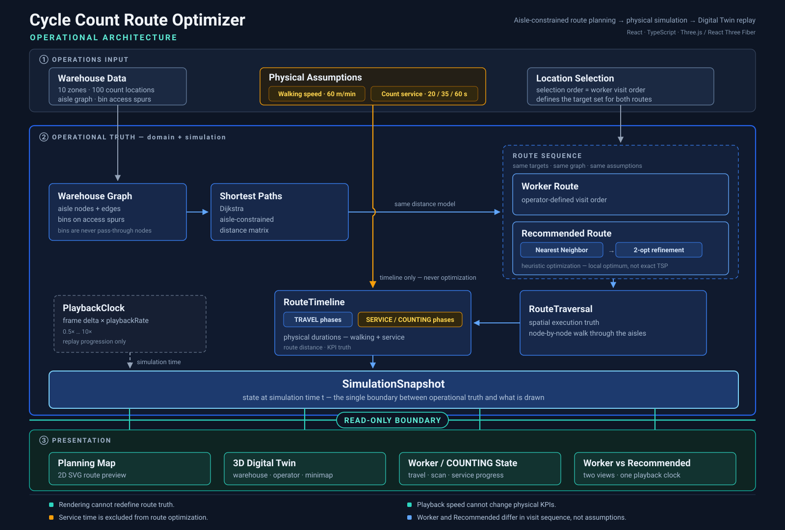
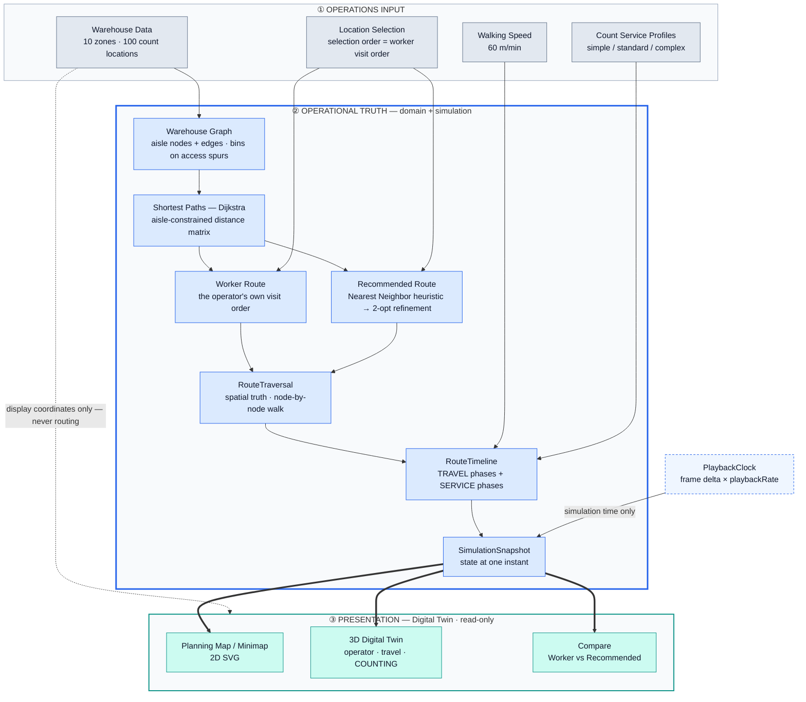
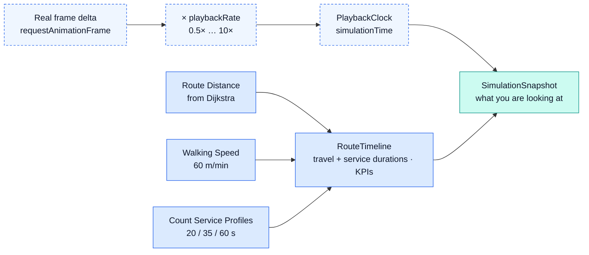

# Architecture

The system turns a warehouse floor into a graph, plans a cycle-count route over it, and then
replays that plan on a physical timeline that separates walking from counting. Everything above the
presentation band is **operational truth** — distances, durations, and completion state — computed
once and never revised by anything downstream. The 3D Digital Twin and the 2D map are read-only
projections of that truth: they consume it, and they can never write back into it.

Full narrative and evidence: [PORTFOLIO_CASE_STUDY.md](./PORTFOLIO_CASE_STUDY.md)

---

## System Architecture

The diagram above is the portfolio view. The Mermaid source below is the maintained technical version — edit it first, then regenerate the graphic to match.

Every arrow crossing into band ③ points one way. The bold arrows are the only channel between
operational truth and what you see; the dashed arrow shows that display coordinates bypass the
truth layer entirely, reaching renderers without ever touching route computation.

Both routes are computed over the **same target set** from the **same distance matrix** — only the
visit order differs. Compare fans out into two independent viewports that share one clock.

---

## Playback Semantics

Replay speed and physical time are different quantities. This is the isolation that keeps the
reported numbers stable when someone hits fast-forward.

The absence of an arrow is the point: **nothing on the dashed replay path reaches `RouteTimeline`.**
Distance, walking duration, service duration, and every KPI are computed before the clock exists, so
`playbackRate` can only change how fast the snapshot is sampled — never what the snapshot reports.

---

## What this architecture protects

- **Rendering cannot redefine route truth.** Display and 3D-world coordinates reach renderers only; a test applies an anisotropic transform to every coordinate and asserts both routes stay byte-identical.
- **Playback speed cannot change physical KPIs.** `playbackRate` enters only the clock; distance, walking duration, and service duration are computed upstream of it.
- **Service time is excluded from route optimization.** Count service profiles enter `RouteTimeline` and never reach Dijkstra, Nearest Neighbor, or 2-opt — route sequence compresses travel, not counting.
- **Worker and Recommended differ only in sequence.** Same targets, same graph, same service assumptions, one shared clock — so the comparison isolates the single variable it claims to measure.

> The recommendation is a **heuristic** — Nearest Neighbor construction refined by 2-opt local search,
> reaching a local optimum. It is not an exact TSP solution, and no machine learning is involved.
